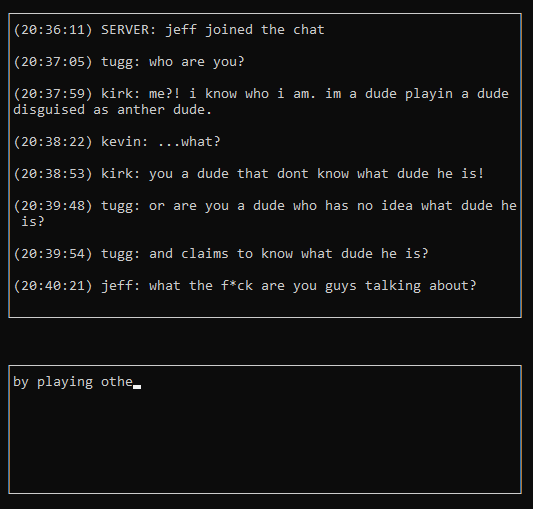

# ShiTTYchat
ShiTTYchat is a barebones terminal chat room written in C. I wrote it for fun, and to learn more about the client-server architecture, sockets, and encryption.

ShiTTYchat is designed as a simple client-server model, meaning it is actually composed of two separate programs: a client and a server. The client and server communicate with each other using the Linux sockets API. After a brief handshake, all communication between the two is encrypted using a \*textbook RSA algorithm that I implemented with the help of GNU's Multiple Precision Arithmetic Library. The client's user interface was written using the ncurses library.

## Build and Run
```bash
pute:~$ git clone https://github.com/krglaws/shittychat
pute:~$ cd shittychat/
pute:~/shittychat$ make client
pute:~/shittychat$ ./client.out -u jeff -i 73.178.35.36
```



## Settings
Several important application settings may be modified (carefully) in the `shared/include/settings.h` header file, where you can change things like the encryption key bit length, the maximum number of users permitted into a server, the maximum username length, and others.

## Depencies
1. ncurses `sudo apt install libncurses5-dev`
2. GNU Multiple Precision Arithmetic Library `sudo apt install libgmp3-dev`

## Notes:
*\* "Textbook" meaning I ripped the algorithm straight off of Wikipedia, and is probably easily exploited if you know what you're doing. Obviously, you should NOT send sensitive information using this application, as its safety will not be guarunteed. I decided to encrypt the client-server communication for the sole purpose of learning a bit about encryption.*
